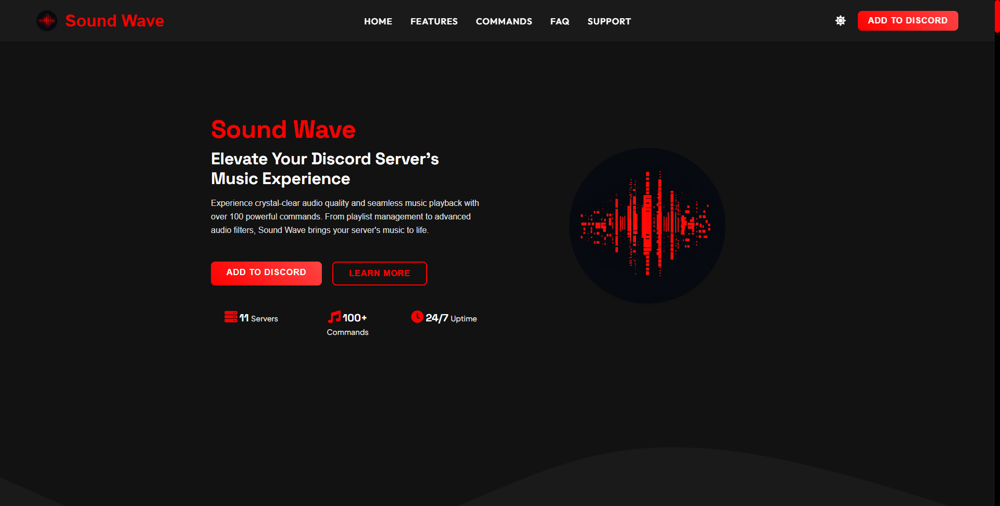
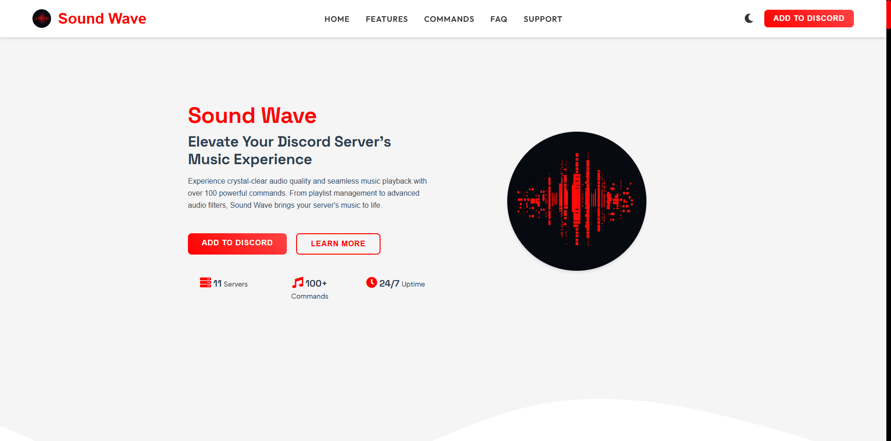
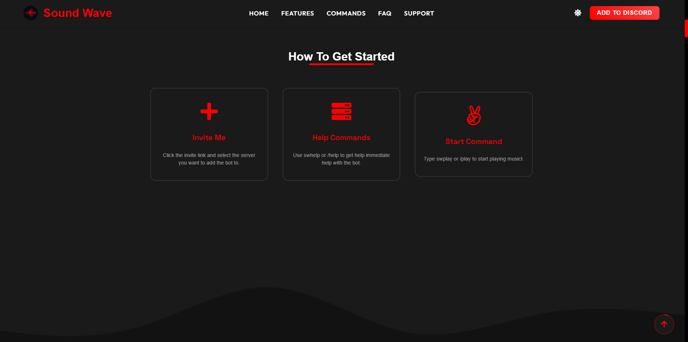
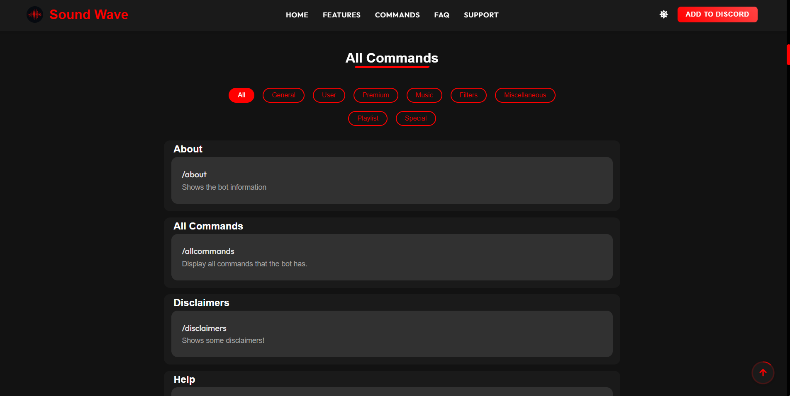
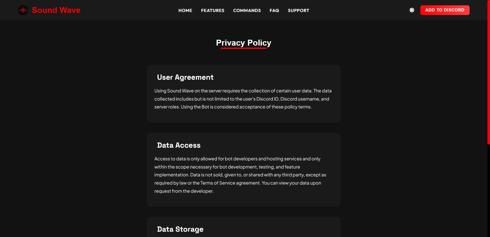
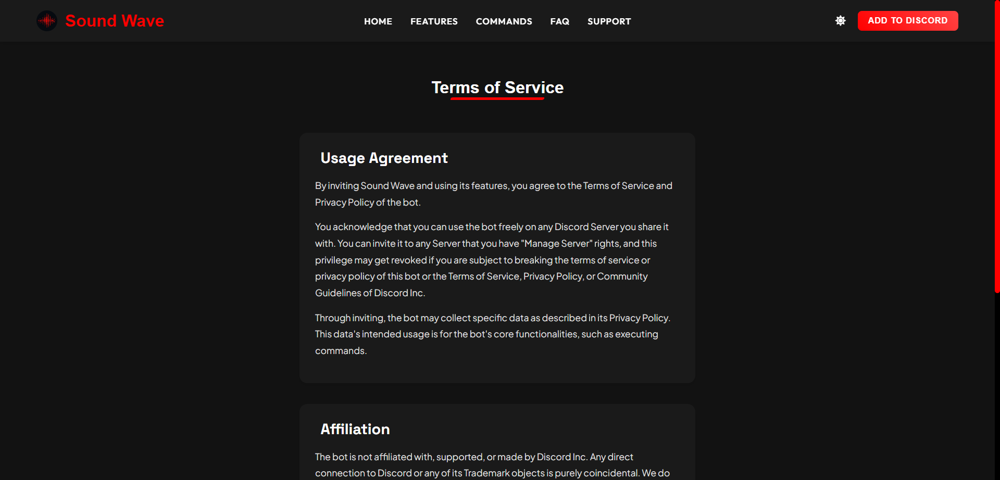

# 🎵 Sound Wave - Discord Music Bot Website

A modern, responsive website for the Sound Wave Discord music bot, featuring a clean and mobile friendly design.

  
  

## 🌟 Features

🎨 Modern and responsive design
🌓 Dark/Light mode toggle
📱 Mobile-friendly interface
🎵 Comprehensive command list
❓ FAQ section
🔄 Smooth animations
🎯 Easy navigation

## 🛠️ Technologies Used

 HTML5
 CSS3
 JavaScript
 Express.js
 Node.js

## 🚀 Getting Started

Clone the repository `git clone https://github.com/Koma4k0/discord-bot-website.git` 
Install dependencies `npm i or npm install`
Start the development server `npm run dev`
Open your browser and visit `http://localhost:3000`

## 📸 Screenshots

